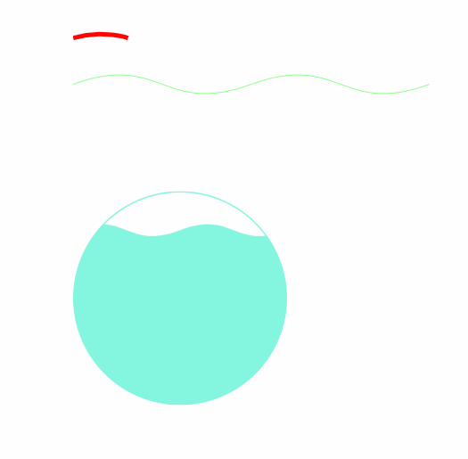
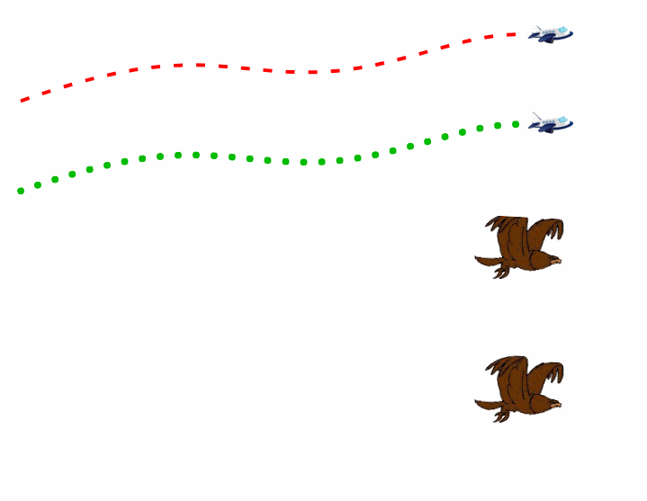

> 由于工作中的项目经常涉及一些动画，有时候css3已经不够用，所以学习了svg，并针对一些常用动画、做过的动画做一些整理，若有帮助的话不要忘记star哟；如有不足，望不吝赐教。

#### 预备知识：
该项目并没有打算讲解svg的基础知识，所以需要各位看官提前学习好svg相关基础知识，至少要动的基本元素的用法，从零开始的可以看看慕课网的一个课程 [走进SVG](https://www.imooc.com/learn/143)，还可以顺便看下[教程](https://brucewar.gitbooks.io/svg-tutorial/1.SVG%E6%95%99%E7%A8%8B.html)，以上仅供参考。

## 1、各demo主要实现的svg动画

- [x] 01_动态绘制线条 [demo补充说明](./doc/01_动态绘制线条.md) [demo源码](./demos/01_动态绘制线条.html)
- [x] 02_动态文本描边 [demo补充说明](./doc/02_动态文本描边.md) [demo源码](./demos/02_动态文本描边.html)
- [x] 03_路径变形动画 [demo补充说明](./doc/03_路径变形动画.md) [demo源码](./demos/03_路径变形动画.html)
- [x] 04_路径跟随动画 [demo补充说明](./doc/04_路径跟随动画.md) [demo源码](./demos/04_路径跟随动画.html)
- [x] 05_人脸扫描、打点、连线动画 [demo补充说明](./doc/05_人脸扫描、打点、连线动画.md) [demo源码](./demos/05_人脸扫描、打点、连线动画.html)

## 2、效果预览

#### 01

#### 02

#### 03

#### 04

#### 05

## 3、参考文章及一些有用的小工具

教程：https://brucewar.gitbooks.io/svg-tutorial/1.SVG%E6%95%99%E7%A8%8B.html

蒙版、蒙版动画使用：
https://www.jianshu.com/p/1677a50ba446
https://www.jianshu.com/p/3a9fe0989fb5

SVG路径动画：
https://juejin.im/post/590941e75c497d0058546c95
https://juejin.im/post/591514b2570c3500692d7235
https://juejin.im/post/59195c22a0bb9f005ff711b2

二次三次曲线呈现工具： http://dayu.pw/svgcontrol
波浪路径绘制工具：https://codepen.io/anthonydugois/pen/mewdyZ
Svg路径在线绘制工具：
https://editor.method.ac/ (我最喜欢这个)
http://jxnblk.com/paths/
